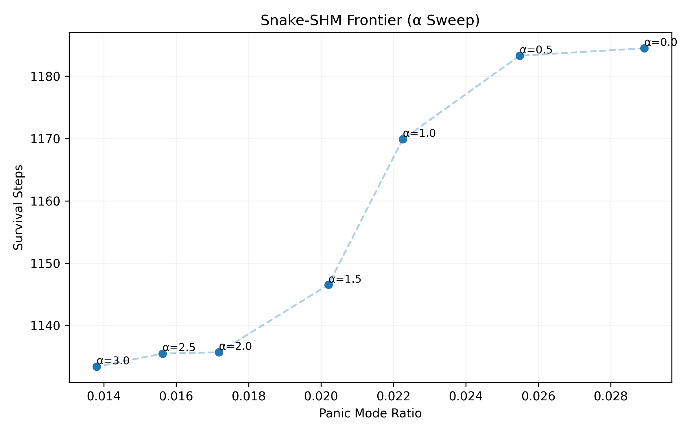

# Snake-SHM

**Risk-Priced Behavior Shaping under Spatial Constraint**

---

## Purpose

**Snake-SHM** is a minimal Snake-based environment used as **secondary embodied evidence**.

Its purpose is **not** to maximize score or survival, but to demonstrate a single point:

> When control logic is fixed,
> **risk pricing alone reshapes behavioral style**,
> even in a tightly constrained spatial system.

Snake-SHM exists to **corroborate**, not to lead.
All primary claims are derived from **Vacuum-X**.

---

## Positioning in This Repository

* **Vacuum-X**: primary system, exposes a trade-off frontier
* **Snake-SHM**: secondary system, validates *behavioral shaping* under constraint

Snake-SHM intentionally avoids introducing:

* learning
* policy switching
* complex planning
* environment scaling

This is deliberate.

---

## Environment Overview

Snake-SHM is based on the classic Snake game with:

* deterministic grid dynamics
* growing body length
* hard spatial constraints
* collision-based termination

The environment is intentionally **simple and unforgiving**.

Unlike Vacuum-X, Snake-SHM offers:

* no explicit charging station
* no long-horizon planning advantage
* limited room for recovery once trapped

This makes it suitable for observing **style changes**, not optimization.

---

## Control Structure (Frozen)

The control structure is **identical across all runs**.

* No learning
* No adaptive strategy changes
* No parameter-dependent logic branches

The agent operates with:

* a greedy food-seeking baseline
* a panic / survival mode triggered by risk thresholds

If insufficient viability is detected,
**Panic / NOOP cycling is emitted as a valid control output**,
not as an error state
(see `shared/terminology.md`).

---

## Risk Pricing Parameter (α)

A single scalar parameter **α** is swept.

> **α controls how strongly accumulated risk influences the panic threshold.**

Importantly:

* α does **not** change the agent’s logic
* α does **not** add new behaviors
* α only scales *risk sensitivity*

**Interpretation:**

* **High α** → risk is priced **expensive** → more conservative thresholds
  → enter panic/survival mode more readily to preserve viability.

* **Low α** → risk is priced **cheap** → more aggressive thresholds
  → defer panic/survival mode, prioritize growth/efficiency.

α is the **only experimental degree of freedom**.

---

## Experimental Design

### Parameter Sweep

```text
α ∈ {0.0, 0.5, 1.0, 1.5, 2.0, 2.5, 3.0}

```

For each α:

* identical control logic
* identical environment distribution
* multiple deterministic seeds

No tuning or adaptation is performed.

---

### Metrics Collected

For each run, the following are recorded:

* **Survival Steps**
* **Final Length**
* **Panic Ratio**
(fraction of steps spent in panic / survival mode)

These metrics are intentionally minimal.

---

## Observed Behavior

The α-sweep produces a **monotone behavioral transition**:

<p align="center">

</p>

Observed pattern:

* Increasing α
* increases panic frequency
* reduces survival time
* reduces overall growth


There is **no optimal α**.

This is expected.

---

## Interpretation

Snake-SHM demonstrates that:

* **Panic / NOOP cycling can be a viable survival output**
under extreme spatial constraint
* Risk pricing reshapes *how* the agent survives,
not *whether* it can win

Unlike Vacuum-X:

* There is no efficiency–survival “sweet spot”
* The system exhibits a **continuous style spectrum**, not a frontier bend

This contrast is intentional and informative.

---

## Interpretation Boundaries

The results support the following **restricted statement only**:

> Risk pricing is sufficient to reshape behavior style
> under fixed logic and strong spatial constraints.

They do **not** support:

* claims of optimality
* performance comparisons
* transfer claims beyond this environment

---

## Reproducibility

* Deterministic seeds
* CPU-only execution
* Minimal dependencies
* All outputs written to `data/` and `figures/`
* No source-directory pollution

Primary scripts are located in:

```text
snake_shm/src/

```

---

## Status

Snake-SHM is **concluded and frozen**.

* Clean α-sweep completed
* Aggregated results committed
* No additional mechanisms planned

It is retained solely as **secondary embodied evidence**.

---

## Related Files

* `shared/terminology.md`
Canonical definitions of Panic, NOOP, Risk Pricing
* `snake_shm/src/`
Frozen Snake-SHM implementations
* `snake_shm/data/`
Aggregated sweep results
* `snake_shm/figures/`
Frontier visualization


