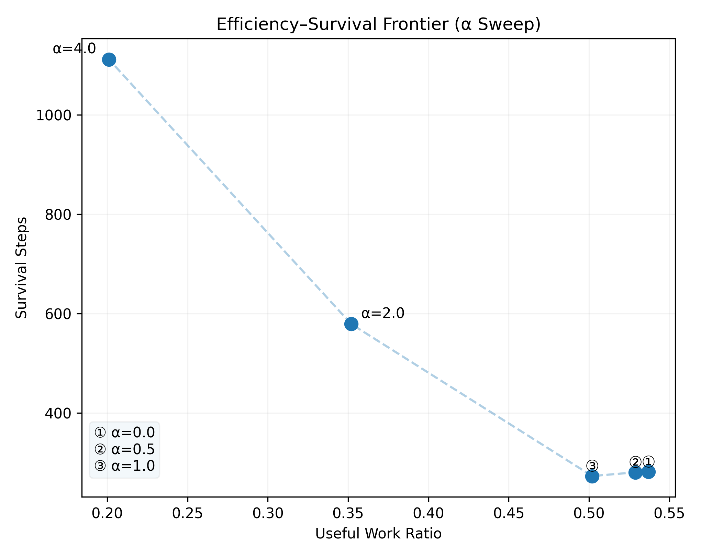
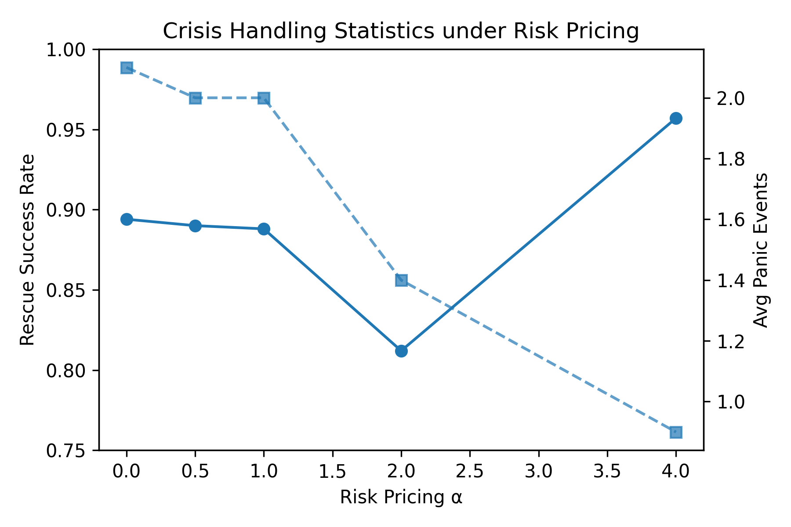

# Vacuum-X

**A Minimal Probe for Efficiency–Survival Trade-offs via Risk Pricing**

---

## Purpose

**Vacuum-X** is a minimal embodied simulation designed to study a single question:

> Under fixed control logic, how does *risk pricing* alone shape
> the trade-off between productive work and survival?

The system does **not** aim to optimize performance, learn policies,
or propose a general solution.
It is a **measurement-oriented probe** for exposing structural trade-offs.

---

## Positioning

Within the overall repository:

* **Vacuum-X** is the **primary experimental system**
* **Snake-SHM** serves only as secondary, corroborating evidence

All central claims regarding **efficiency–survival trade-offs**
are derived from Vacuum-X.

---

## Environment Overview

Vacuum-X is a grid-based environment with the following characteristics:

* Static obstacles
* A limited energy budget
* A charging station (goal-dependent survival)
* Partial observability of future risk

At each step, the agent must choose between:

* **Normal operation** (productive work)
* **Panic / NOOP / survival-oriented actions** (risk mitigation)

Crucially, **inaction is allowed and explicitly modeled**.

---

## Control Structure (Fixed)

The controller architecture is **fixed across all experiments**.

There is:

* no policy switching
* no learning
* no parameter-dependent logic branches

The controller evaluates:

* instantaneous risk
* accumulated stress
* available energy

and produces one of a small, predefined set of actions.

If insufficient information or viability is detected,
**Panic / NOOP is emitted as a valid control output**
(see `shared/terminology.md`).

---

## Life Pressure Index (LPI)

Vacuum-X introduces a scalar internal state:

**Life Pressure Index (LPI)**

LPI is a smoothed accumulation of:

* current environmental risk
* recent structural damage
* forced or constrained actions

Conceptually:

* LPI tracks *how close the agent is to irreversible failure*
* It is **not** a reward, loss, or optimization signal
* It only informs risk-aware decision thresholds

LPI does not directly choose actions.
It only modulates **how expensive risk is considered**.

---

## Risk Pricing Parameter (α)

A single scalar parameter **α** is introduced:

> **α controls the marginal price of risk.**

Importantly:

* α does **not** alter the control logic
* α does **not** introduce new behaviors
* α only scales how strongly LPI influences risk thresholds

Interpretation:

* **Low α** → risk is cheap → aggressive, efficient behavior
* **High α** → risk is expensive → conservative, survival-oriented behavior

α is the **only swept parameter** in the core experiments.

---

## Experimental Design

### Parameter Sweep

α is swept over a fixed set of values:

```text
α ∈ {0.0, 0.5, 1.0, 2.0, 4.0}
```

For each α:

* identical control logic
* identical environment distribution
* multiple random seeds

No adaptive tuning is performed.

---

### Metrics Collected

For each run, the following metrics are recorded:

* **Survival Steps**
  Total time before termination
* **Useful Work Ratio**
  Fraction of steps spent in normal (productive) mode
* **Panic Count / Duration**
* **Rescue Success Rate**
  Fraction of panic episodes that successfully return to normal operation

These metrics are intentionally simple and directly observable.

---

## Core Result: Coase Frontier

The sweep over α exposes a clear **efficiency–survival trade-off**
(often referred to as a *Coase Frontier* in this context).

<p align="center">
  
</p>

Observed pattern:

* Low α

  * high useful work ratio
  * short survival
* High α

  * long survival
  * low useful work ratio
* Intermediate α

  * large marginal survival gain
  * moderate efficiency loss

This frontier emerges **without changing the controller**.

---

## Crisis Handling Behavior

Additional statistics highlight how crisis behavior changes with α:

<p align="center">
  
</p>

Key observation:

* More frequent panic does **not** imply lower stability
* Fewer panic events do **not** guarantee better outcomes

Panic frequency, panic timing, and rescue success are **distinct variables**.

---

## Interpretation Boundaries

The results support the following **restricted statement only**:

> Pricing risk differently is sufficient to induce qualitatively different
> efficiency–survival trade-offs under identical control logic.

The results do **not** imply:

* optimal α values in general
* normative recommendations
* transfer claims to human or social systems

---

## Reproducibility

* Deterministic seeds
* CPU-only execution
* No external dependencies beyond standard Python scientific libraries
* All outputs written to `data/` and `figures/`
* No source-directory pollution

Primary scripts are located in:

```text
vacuum_x/src/
```

---

## Status

Vacuum-X is **concluded and frozen**.

* Core α-sweep completed
* Figures committed
* No additional mechanisms planned

The system is retained as a **reference probe** for studying
risk pricing under partial observability.

---

## Related Files

* `shared/terminology.md`
  Canonical definitions of Panic, NOOP, Risk Pricing, and related terms
* `vacuum_x/src/`
  Simulation and sweep implementation
* `vacuum_x/data/`
  Recorded trajectories (benign / stress)
* `vacuum_x/figures/`
  Presentation figures

